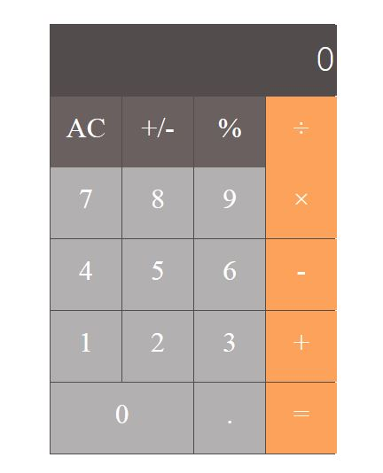

<h1>Mac-Calculator </h1>

My First attempt to design Max calculator with HTML5, CSS3

- I used grid to design the calculator. Using a grid is very easy and fast.

- Next step to write java script to access my 
s element which I will use as my button. 
- I need to read value of each 
 when I click on them (onClick)
  
  

